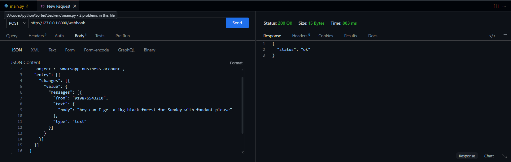
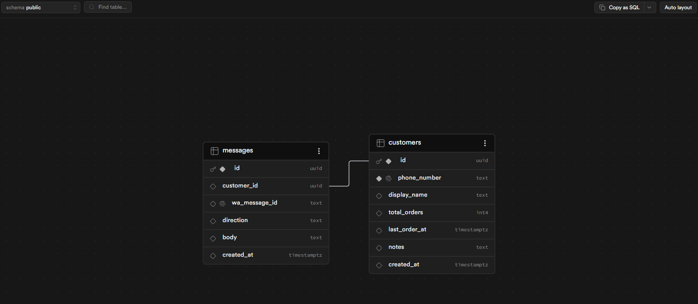
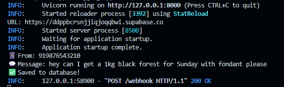
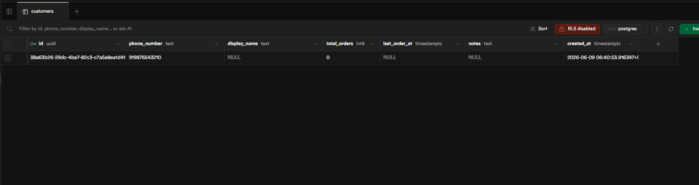

# Sorted — Developer Log
## Day 1 & 2: Setting Up the Webhook Pipeline
**Nathan Ivor Sequeira | June 2026**

---

## What I Was Trying to Build

The goal for the first two days was to get the foundation of Sorted working — a FastAPI backend that can receive an incoming WhatsApp message, extract the phone number and message text, and save it to a Supabase database. No frontend, no AI yet. Just the plumbing.

---

## Day 1 — Environment Setup & First Webhook

### What I did

Before writing any code, I watched three YouTube videos to understand the core concepts:
- What webhooks are and how they differ from regular API calls
- How Meta's WhatsApp Cloud API uses webhooks (verification + event delivery)
- How ngrok exposes a local server to the internet

Once I had the mental model, I set up the project. This took longer than expected because of environment issues.

### Challenges I faced

**Python PATH issue on Windows 11**

After installing Python 3.11, running `python --version` in the terminal returned nothing — Windows was pointing to the wrong Python (the Microsoft Store stub). I had to go into Environment Variables, find the actual Python 3.11 install path at `C:\Users\USER\AppData\Local\Programs\Python\Python311\`, and move it to the top of the PATH list so it took priority over the Windows App alias.

**pip not recognized**

Even after fixing the PATH, `pip install` threw a "not recognized" error. The fix was to use `python -m pip install` instead — this calls pip through Python directly, bypassing the PATH issue entirely.

**PowerShell blocking venv activation**

When I tried to activate the virtual environment with `.\venv\Scripts\activate`, PowerShell threw a security error:
```
running scripts is disabled on this system
```
The fix was running this once to allow local scripts:
```bash
Set-ExecutionPolicy -ExecutionPolicy RemoteSigned -Scope CurrentUser
```

### What I built

Once the environment was sorted, I wrote a simple FastAPI server with two routes:

- `GET /webhook` — handles Meta's one-time verification handshake. Meta sends a `hub.challenge` token and your server has to echo it back. If the `verify_token` matches, Meta accepts your URL.
- `POST /webhook` — receives all incoming WhatsApp events. For now, just prints the raw payload.

I tested the GET handler by visiting:
```
http://127.0.0.1:8000/webhook?hub.mode=subscribe&hub.challenge=1234&hub.verify_token=mysecrettoken
```
It returned `1234` — exactly what Meta expects.



I then set up ngrok to expose the local server publicly and confirmed the same test worked over the internet. That was the end of Day 1.

---

## Day 2 — Payload Parsing, Supabase, and Saving Messages

### Meta Developer Account Issue

Before moving to Supabase, I tried to set up the actual WhatsApp Cloud API through Meta's developer portal. This turned into a dead end — Meta kept rejecting my phone number during developer registration, and the workarounds (mobile browser, different accounts) didn't help either.

The decision: skip Meta entirely for now and mock WhatsApp messages using **Thunder Client** (a VS Code extension). This turned out to be the smarter approach anyway — it lets me build and test the entire order parsing pipeline without being blocked by Meta's onboarding.

### Extracting phone and message text

I updated the POST handler to drill into the nested WhatsApp JSON payload and pull out the two things I actually need:

```python
message = body["entry"][0]["changes"][0]["value"]["messages"][0]
phone = message["from"]
text = message["text"]["body"]
```

The payload is deeply nested — `entry → changes → value → messages` — which is just how Meta structures it. I wrapped this in a `try/except` so non-message events (like delivery receipts) get silently ignored instead of crashing the server.

### Setting up Supabase

I created a free Supabase project (Mumbai region) and ran SQL to create two tables:

**`customers`** — stores each unique WhatsApp number with their display name, order count, and notes.

**`messages`** — stores every inbound and outbound message linked to a customer via `customer_id`.

Both tables have RLS enabled.



One issue here: when I pasted the Supabase project URL into `.env`, I accidentally included the `/rest/v1/` path suffix. The error I got was:

```
SupabaseException: supabase_url is required
```

That bottom line is what matters — everything above it in a Python traceback is just the call chain. Once I understood that, debugging became much faster. The fix was removing `/rest/v1/` from the URL so it was just `https://xxxxx.supabase.co`.

### Connecting FastAPI to Supabase

I created `db/client.py` to initialise the Supabase client as a singleton:

```python
from supabase import create_client
from dotenv import load_dotenv
import os

load_dotenv()

supabase = create_client(
    os.getenv("SUPABASE_URL"),
    os.getenv("SUPABASE_SERVICE_KEY")
)
```

Then updated the webhook handler to:
1. Upsert the customer (create if new, skip if existing) using `on_conflict="phone_number"`
2. Insert the message linked to that customer's UUID

### End result

Sending a mocked WhatsApp message via Thunder Client now produces this in the terminal:

```
📱 From: 919876543210
💬 Message: hey can I get a 1kg black forest for Sunday with fondant please
✅ Saved to database!
```



And the data is visible in Supabase — a customer row with a UUID and phone number, and a messages row linked to it.



---

## Current Project Structure

```
sorted/
├── backend/
│   ├── db/
│   │   └── client.py         # Supabase client singleton
│   ├── main.py               # FastAPI app — webhook GET + POST handlers
│   ├── .env                  # SUPABASE_URL, SUPABASE_SERVICE_KEY, VERIFY_TOKEN
│   └── requirements.txt
├── .gitignore
├── LICENSE
└── README.md
```

---

## What's Working

- FastAPI server runs locally with hot reload via `uvicorn main:app --reload`
- Webhook verification handler correctly echoes `hub.challenge`
- POST handler extracts phone number and message text from mocked WhatsApp payload
- Customer is upserted in Supabase on each message (no duplicates)
- Message is saved to Supabase linked to the customer


---

## Key Lessons

- Always read the **bottom line** of a Python traceback — that's the actual error. Everything above is just how you got there.
- `python -m pip install` is more reliable than `pip install` on Windows when PATH is messy.
- Mocking external APIs (Meta, in this case) with Thunder Client is faster and less frustrating than fighting through third-party onboarding during early development. Build the logic first, wire up the real service later.
- `.env` values must be clean — no trailing slashes, no extra path segments, no quotes around values.

---

*Sorted — MIT Licence — github.com/Nathan-sudo-pycharm/sorted*